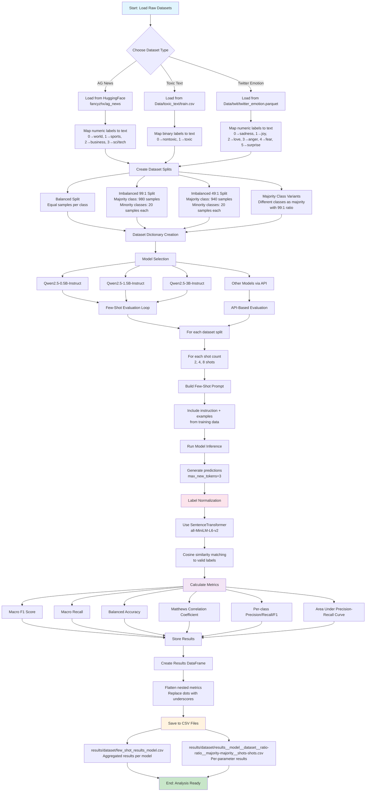

# LLM Evaluations on Imbalanced Datasets

This project explores how few-shot and zero-shot LLM classifiers behave under class imbalance. It provides ready-to-run Jupyter notebooks for creating balanced/imbalanced splits, prompting LLMs via Hugging Face or OpenRouter-style APIs, and logging results for datasets like AG News, Toxic Text, and Twitter Emotion.

## Features

- Few-shot and zero-shot evaluation notebooks
- Balanced vs. imbalanced prompt construction and dataset splits
- Local CPU-friendly Docker image for running notebooks
- Results saved to `results/` as CSVs

## Repository Structure

- `Data/`
  - `ag_news/` parquet files generated for balanced/imbalanced train and small test splits
  - `toxic_text/`, `twit/` raw or prepared data files
- `results/` CSV outputs per dataset and model
- `eval_with_API.ipynb` end-to-end AG News prep + OpenRouter API evaluation
- `eval_with_hgf_zero_shot.ipynb` zero-shot evaluation via Hugging Face
- `eval_with_hgf_few_shots.ipynb` few-shot evaluation via Hugging Face
- `fine_tune.ipynb` optional fine-tuning experiments (WIP)
- `requirements.txt` Python dependencies
- `Dockerfile`, `run_docker.sh` containerized Jupyter Lab environment

## Quickstart

### 1) Local environment

```bash
python3 -m venv .venv && source .venv/bin/activate
pip install -r requirements.txt
pip install jupyterlab papermill notebook
jupyter lab
```

### 2) Docker environment (recommended)

```bash
bash run_docker.sh
```

This builds the image and starts Jupyter Lab at `http://localhost:8888` with no token.

## API Keys and Environment

Some flows call hosted LLMs via OpenRouter-compatible APIs.

- Create a `.env` file in the project root:

```
API_KEY=your_openrouter_api_key
```

- The `eval_with_API.ipynb` notebook loads it via `python-dotenv`.

## Datasets

- AG News is pulled from Hugging Face (`fancyzhx/ag_news`) and saved as parquet files for balanced/imbalanced splits and a small test set.
- Toxic Text (`Data/toxic_text/*`) and Twitter Emotion (`Data/twit/twitter_emotion.parquet`) are available for extension.

Generated AG News artifacts (paths):

- `Data/ag_news/ag_news_train_balanced.parquet`
- `Data/ag_news/ag_news_train_imbalanced_99_to_1.parquet`
- `Data/ag_news/ag_news_train_imbalanced_49_to_1_ratio.parquet` (approx 5:1)
- `Data/ag_news/ag_news_test_small.parquet`

## Notebooks

- `eval_with_API.ipynb`
  - Downloads AG News splits
  - Builds balanced and imbalanced few-shot prompts
  - Calls `https://openrouter.ai/api/v1/chat/completions` with a model like `nvidia/nemotron-nano-9b-v2:free`
  - Cleans model outputs and computes accuracy on a small test slice
- `eval_with_hgf_zero_shot.ipynb`
  - Zero-shot evaluation via Hugging Face `transformers`
- `eval_with_hgf_few_shots.ipynb`
  - Few-shot evaluation via Hugging Face with configurable shots

Open the notebooks in Jupyter Lab and run top-to-bottom. Adjust model names and sampling sizes as desired.

## Reproducing Results

- Existing few-shot CSVs live under `results/<dataset>/`.
- To add new results, run the relevant notebook and export metrics to CSV (the notebooks demonstrate how predictions and accuracies are computed and printed).

## Requirements

Key packages:

- `transformers`, `torch`, `huggingface_hub`, `bitsandbytes`
- `scikit-learn`, `tqdm`, `python-dotenv`
- `sentence_transformers` (optional)

The Docker image installs a nightly CPU PyTorch build for compatibility:

- `pip install --pre torch torchvision torchaudio --extra-index-url https://download.pytorch.org/whl/nightly/cpu`

## Running Headless / CI

You can automate notebook execution with `papermill` inside Docker or locally, e.g.:

```bash
papermill eval_with_API.ipynb out.ipynb
```

## Project Workflow

The complete project workflow from dataset preparation to results analysis:



### Key Workflow Components:

1. **Dataset Preparation**: Load and map labels for AG News, Toxic Text, and Twitter Emotion datasets
2. **Dataset Splitting**: Create balanced and imbalanced variants with different ratios (99:1, 49:1) and majority class variations
3. **Model Evaluation**: Few-shot evaluation with different shot counts (2, 4, 8) using Qwen models or API-based options
4. **Prompt Engineering**: Build instruction-based prompts with examples from training data
5. **Label Normalization**: Use semantic similarity to map model predictions to valid labels
6. **Metrics Calculation**: Compute comprehensive evaluation metrics (F1, Recall, Accuracy, MCC, AUPRC)
7. **Results Storage**: Save structured CSV files for analysis and comparison

## Notes and Tips

- For API-based evaluation, rate limits may apply; the notebook includes brief sleeps.
- Ensure prompts only output one of the canonical labels (`world`, `sports`, `business`, `sci/tech`).
- If you update dataset sizes, also adjust prompt shots and evaluation slice sizes accordingly.
